# xAPI-SG Processor

## Introduction

**Processor of traces following the xAPI-SG standard data format**

The **Experience API - Serious Games (xAPI-SG) processor** is a set of Jupyter Notebooks to process data given in the **xAPI-SG** data format. 
The xAPI-SG statements (traces) are analyzed and, with the information extraced from them, a default set of visualizations is displayed, showing information about the data in xAPI-SG.

## Usage

### 1. Select your mode

The main Jupyter Notebook is **[xAPISGProcessor.ipynb](https://nbviewer.jupyter.org/github/e-ucm/xapi-sg-processor/blob/master/xAPISGProcessor.ipynb)**. In the first line of the notebook:

* set `local = True` if you want to work on a local-hosted Jupyter server.
* set `local = False` if working with a web-hosted Jupyter server.

Keep `storage = file`. You can execute the xAPI-SG Processor and interact with it online using [Binder](https://mybinder.org/v2/gh/e-ucm/xapi-sg-processor/master?filepath=xAPISGProcessor.ipynb).

#### SIMVA

The xAPI-SG Processor can also connect with **[SIMVA](https://github.com/e-ucm/simva-infra)** to analyze the traces stored there as part of experiments.

If you are using SIMVA, the main Jupyter Notebook is **[xAPISGProcessor-SIMVA.ipynb](https://nbviewer.jupyter.org/github/e-ucm/xapi-sg-processor/blob/master/xAPISGProcessor-SIMVA.ipynb)**.

After running the first cell in the notebook, a "Sign in" button will appear in the output. Click the "Sign in" button will pop up a window when you need to enter your **SIMVA credentials**. Once you have done this, run the following cells. Keep `storage = simva`, so you will be able to access all traces JSON files available in your SIMVA account.

### 2. Choose your file with xAPI-SG traces

When running the **[xAPISGProcessor.ipynb](https://nbviewer.jupyter.org/github/e-ucm/xapi-sg-processor/blob/master/xAPISGProcessor.ipynb)** notebook, you will see a widget file selector. 

* If using local mode, the selector will allow you to navigate in your local directory. JSON files will be highlighted in green.

* If using remote mode, you will be able to upload your data file. 

* If you are accessing SIMVA JSON files, you will see a widget file selector similar to the one in local mode.

In any case, choose your JSON file containing a list of xAPI-SG statements.

### 3. Run the analysis

Finally, run the analysis.
 
After selected, all xAPI-SG statements in your JSON file will be processed (the Jupyter Notebook [ProcessxAPISGStatement.ipynb](https://nbviewer.jupyter.org/github/e-ucm/xapi-sg-processor/blob/master/ProcessxAPISGStatement.ipynb) processes each xAPI-SG statement). 

With the information extracted from the statements, the default set of visualizations will be displayed in different tabs in the notebook. See below for details about the visualizations included.

## xAPI-SG

The **Experience API Profile for Serious Games (xAPI-SG)** is a validated xAPI Profile to collect information from serious games. 
Each xAPI-SG statement (trace) represents an activity in the context of a serious game.

For more information about the xAPI-SG Profile, check [our wiki page](https://github.com/e-ucm/rage-analytics/wiki/xAPI-SG-Profile) and the [official vocabulary website](http://xapi.e-ucm.es/vocab/seriousgames).

## Default visualizations

The Jupyter Notebooks with the default set of visualizations are included in the folder */vis*. 

We currently provide the following default 18 visualizations:

### xAPISG-GamesStartedCompleted

It displays a pie chart of games started and completed.

### xAPISG-PlayersProgress

It displays a line chart showing progress over time for each player.

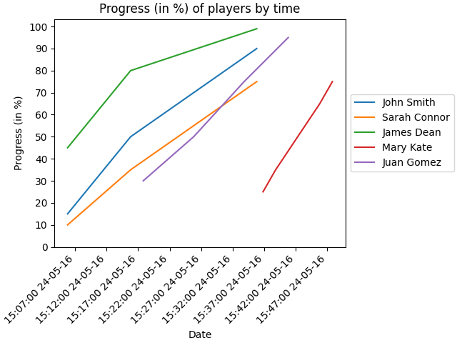

### xAPISG-VideosSeenSkipped

It displays a bar chart showing for each video the total number of times it has been seen and skipped.

### xAPISG-CompletablesProgress

It displays a bar chart showing for each player the progress achieved in the different completables of the game as well as in the total game.

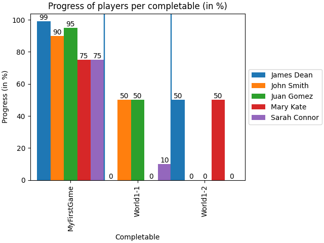

### xAPISG-CompletablesProgressIncreaseDecrease

It displays a points/line chart showing for each player in function of time the progress increase or decrease of different completables of the game.

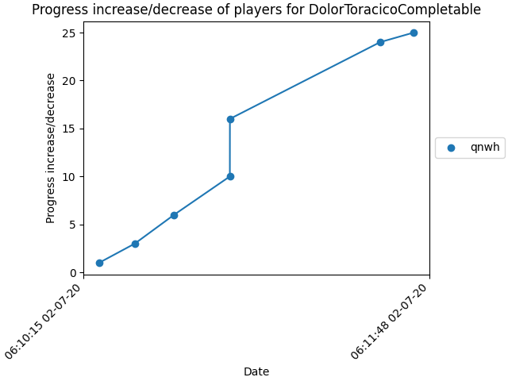

### xAPISG-CompletablesScores

It displays a bar chart showing the score achieved by players in the different completables.

### xAPISG-CompletablesTimes

It displays a bar chart showing for each completable the maximum and minimum time of completion by players.

### xAPISG-CorrectIncorrectPlayer

It displays a bar chart showing for each user the number of correct and incorrect alternatives selected in multiple-choice questions.

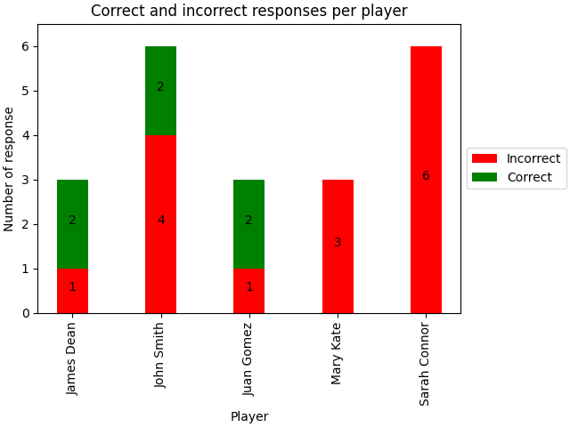

### xAPISG-CorrectIncorrectQuestion

It displays a bar chart showing the total number of correct and incorrect alternatives selected by players in each multiple-choice question.

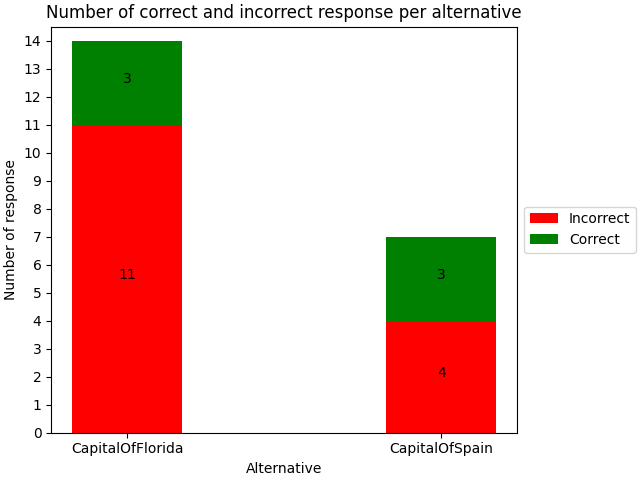

### xAPISG-AlternativesSelectedQuestion

It displays multiple bar charts showing the alternatives selected in each multiple-choice question.

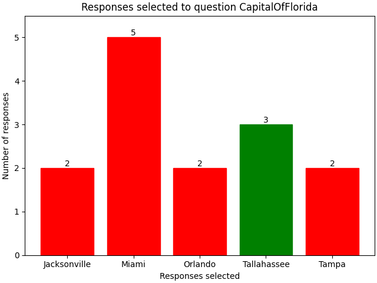

### xAPISG-ItemsInteracted

It displays a multiple bar chart and a heatmap showing the number of times the player has interacted with the item.

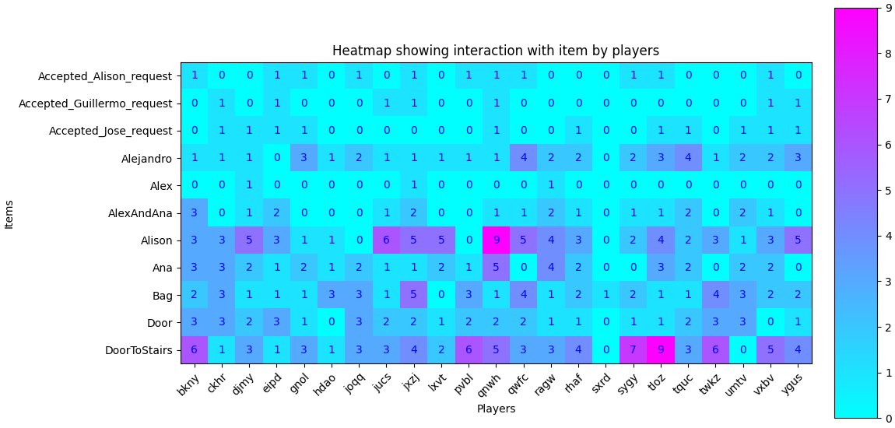

Also, it displays a bubble chart showing a bubble in function of the average number of players who have interacted with the item in a certain period of time.

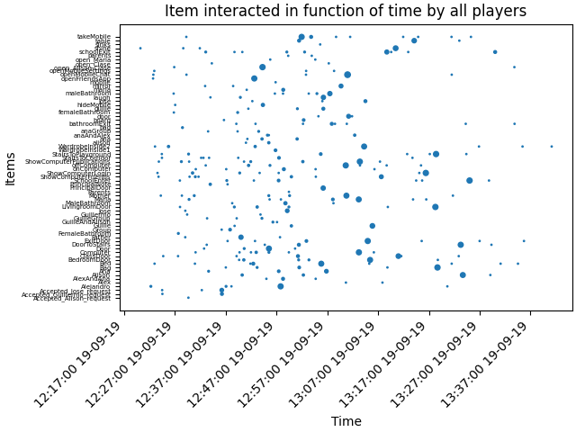

### xAPISG-ItemsActionTypeInteracted

It displays a multiple bar chart showing for each action type (e.g. talk_to) the total number of times the player has interacted with it.

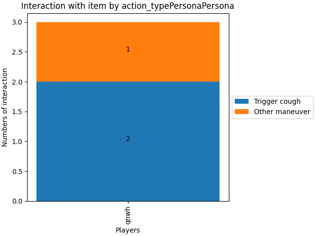

### xAPISG-AccessedAccessible

It displays a multiple bar chart and a heatmap showing for each accessible the total number of time the player has accessed the accessible.

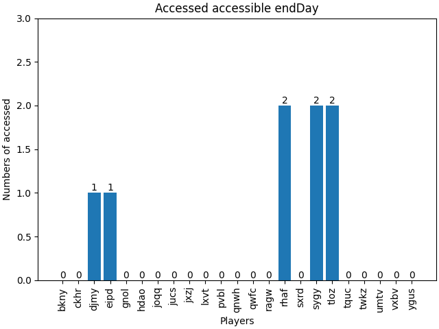

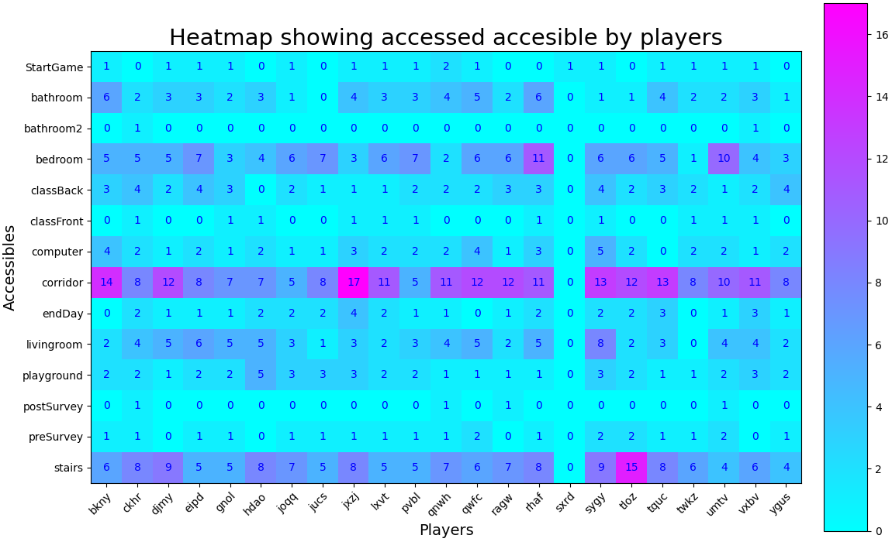

Also, it displays a bubble chart showing a bubble in function of the average number of players who have accessed the accessible in a certain period of time.

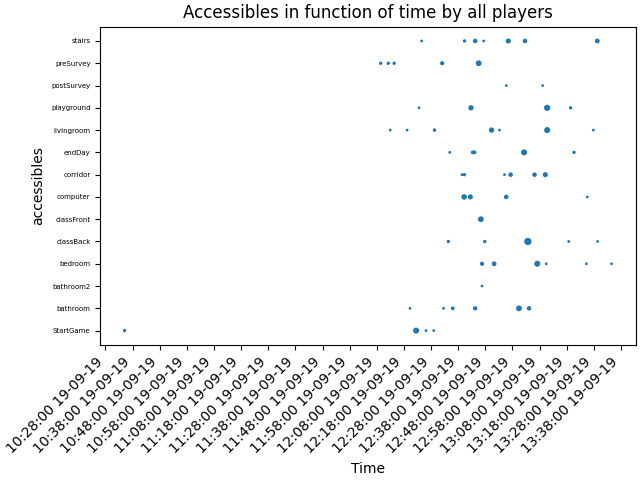
    
### xAPISG-MenusSelected

It displays multiple bar charts showing for each menu the number of times each player select an option.

